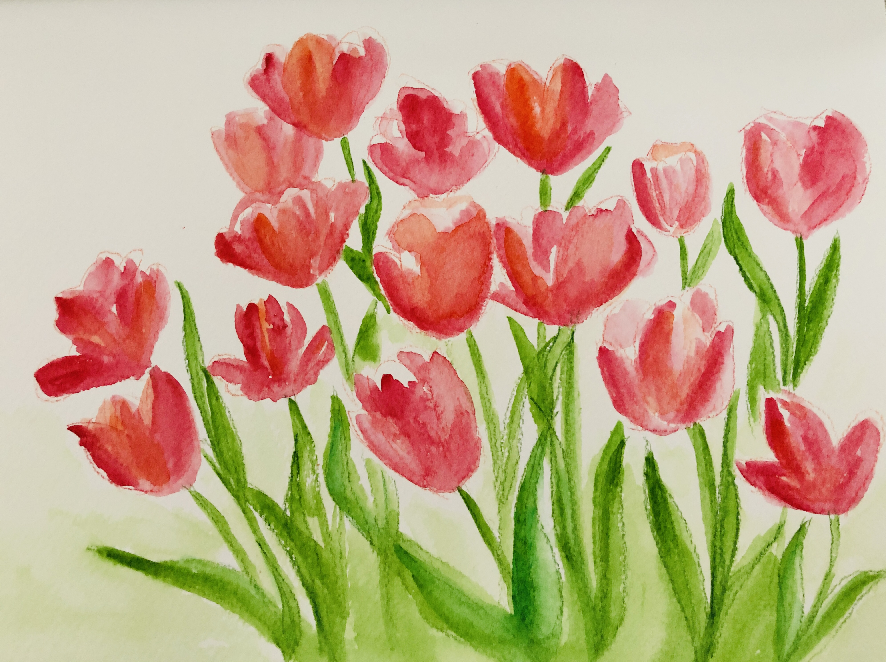
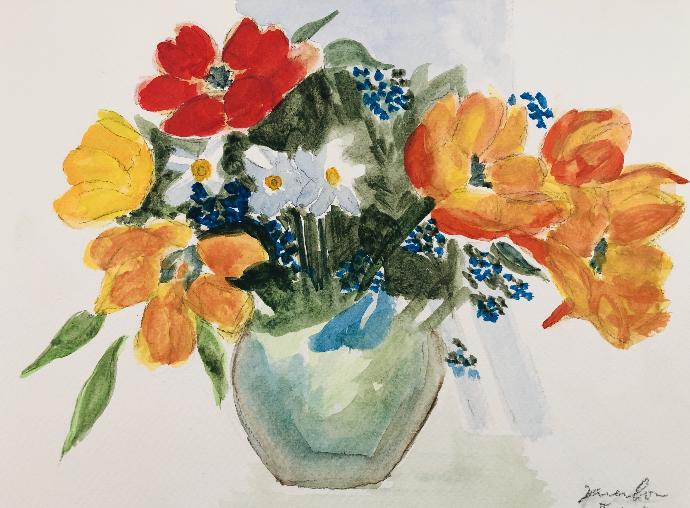
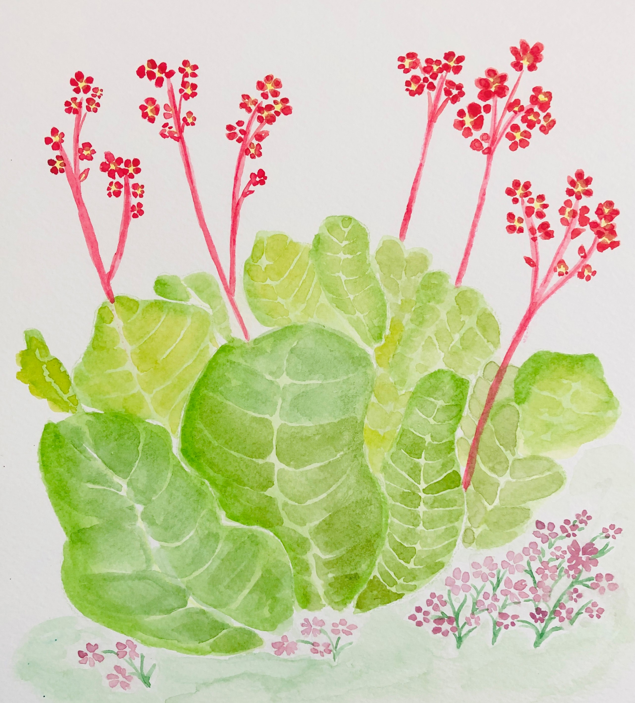

 
## Bio

Kuan is a doctoral candidate in Biostatistics with Professor and Senior Scientist, Dr. Eleanor Pullenayegum in the Department of Child Health Evaluative Sciences at the Hospital for Sick Children and the Division of Biostatistics at Dalla Lana School of Public Health, University of Toronto. Her PhD research focuses on developing novel Bayesian estimation methods that permit causal inference in longitudinal observational studies using administrative databases. Kuan is a CIHR doctoral award recipient.

## Education

**University of Toronto** | Toronto, ON

PhD in Biostatistics | September 2015 - June 2021

**University of Waterloo** | Waterloo, ON

MMath in Statistics (Biostatistics) | September 2011 - September 2012

**University of Alberta** | Edmonton, AB

BSc Honour in Statistics | September 2007 - June 2011

---

###  Fun visualization 

{width=50%}

{width=50%}

{width=50%}

---

Website template [postcards](https://github.com/seankross/postcards)
